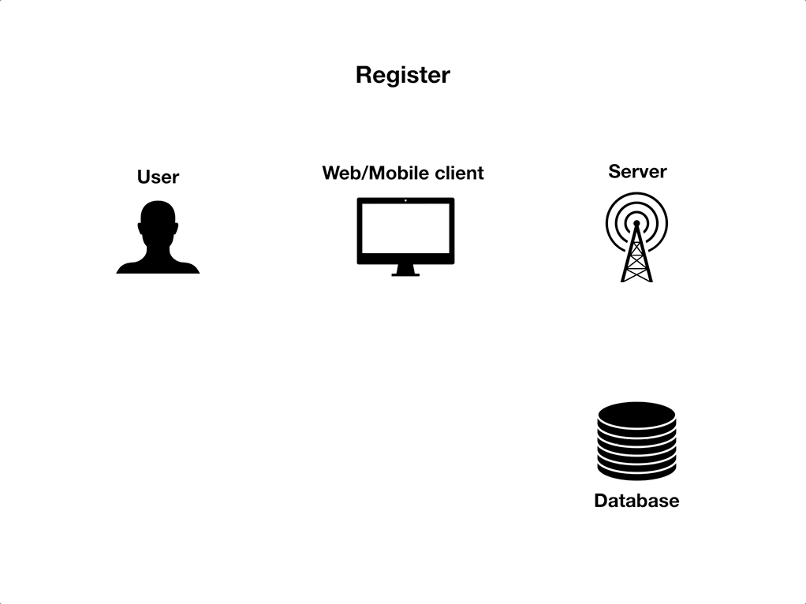
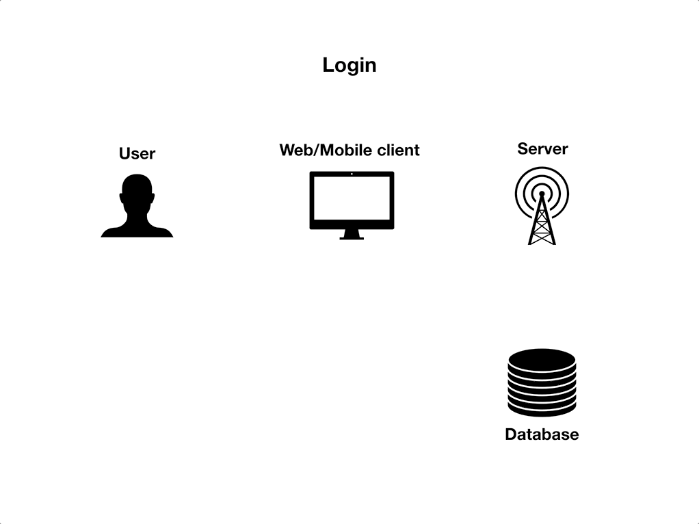
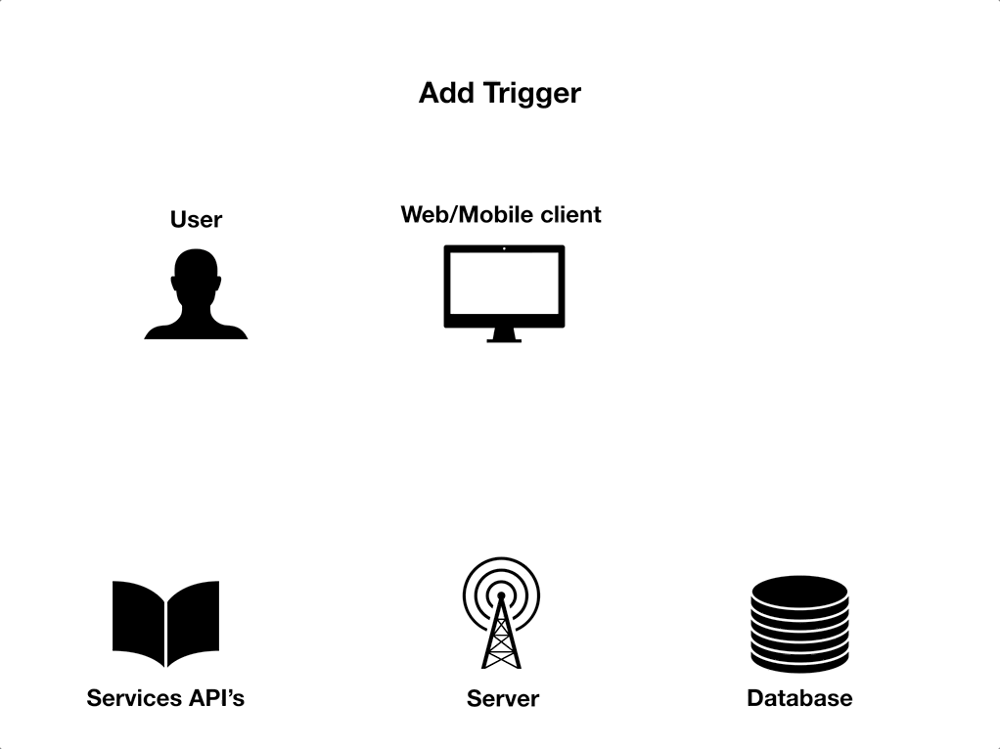

# Area

Area is a web service available through a web application or a mobile application. It allows you to connect between themselves online social networks or application like facebook, gmail etc.. with action and reactions.

when an action is activated, it triggers a reaction. Example : something is commited on your github repository, so our service send you a mail to notify it. 

You can link actions to multiple reaction and automate a lot of processes that took you time before.

## Installation

### Requirement

* Docker CE

### Usage

Clone the Area repository :

`git clone git@git.epitech.eu:/bryan.medica@epitech.eu:/DEV_area_2018`

In order to run all the application elements, run at the root of the repository :

`docker-compose build && docker-compose up`

## Technologies

Area use a lot of web services, modules and libraries to build its web, mobile, and server application

__server__

* [Python 3](https://www.python.org/download/releases/3.0/) - Strong, fast and efficient language
* [Flask](http://flask.pocoo.org/) - Python framework to easily build web server
* [Firebase](https://firebase.google.com/) - Cloud NoSql databse

__Mobile Application__

* [Android Studio](https://developer.android.com/studio) - Mobile application IDE
* [Java](https://www.java.com/fr) - Secured object oriented language

__Web Application__

* [Node js](https://nodejs.org/en) - Node.js is a cross-platform JavaScript run-time environment that executes JavaScript code outside of a browser
* [Express](https://expressjs.com/fr/) - JavaScript framework to build NodeJs web application
* [passport](http://www.passportjs.org/) - NodeJs framwork to develop authentication strategies
* [Bootstrap](https://getbootstrap.com/) - Most popular front-end framwork. HTML and CSS templates

***

# Processes explanation

### Register

### Login

### Add trigger

***

License
----

[MIT](https://choosealicense.com/licenses/mit/)