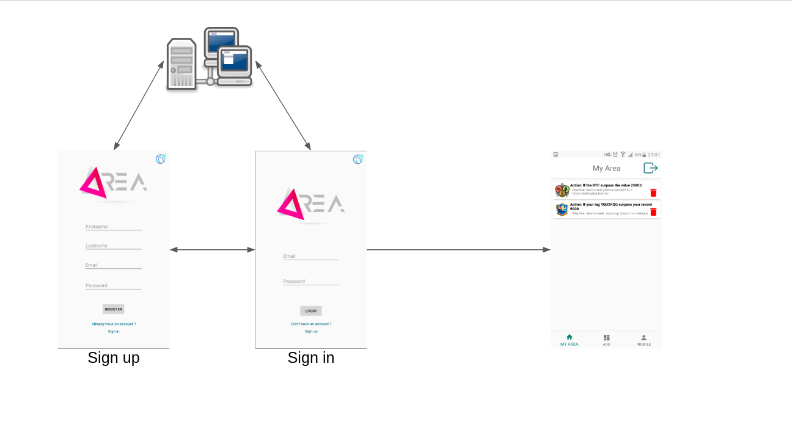
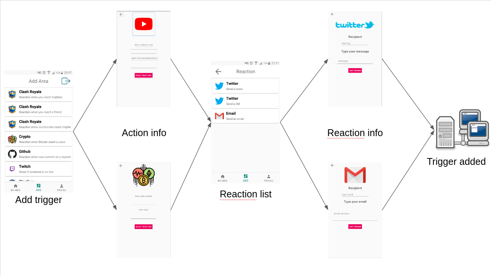

# README about the application
This README explain you how to configure and use the AREA mobile application.

## Prerequisites
- Have an Android.
- Minimum SDK version: 23.
- Internet connection.

## Available service
- Clash Royale.
- Youtube.
- League of Legend.
- Weather.
- Cryptocurrency.
- Github.
- Twitch.
- Twitter.
- Email.

## Installation
You need to connect on the AREA website and go on the route: "/client.apk".
Download the APK.
Install the APK on your mobile.
In first connection, you need to configure the address of the server.

## Connection process

## Add a trigger

**Free Software, Hell Yeah!**
